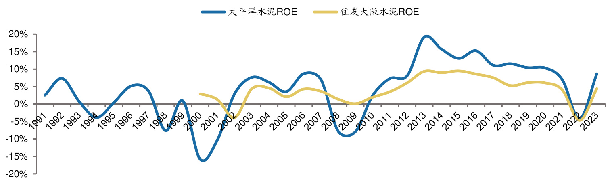
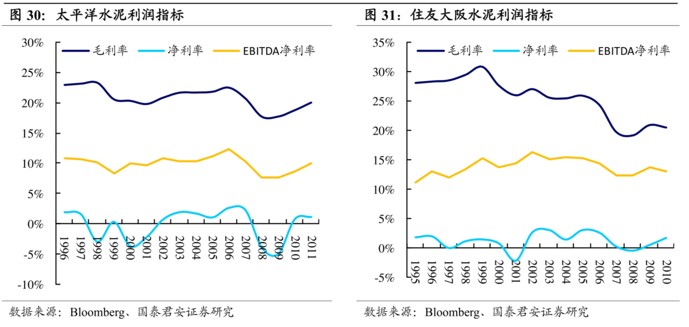
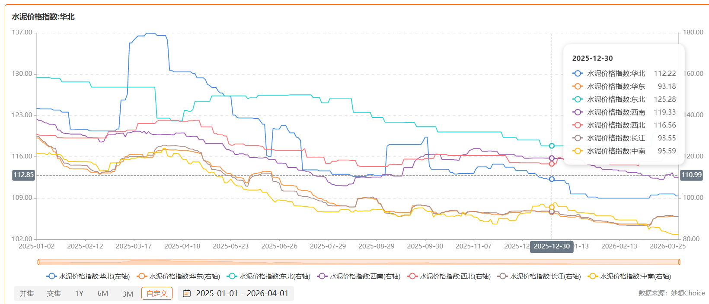
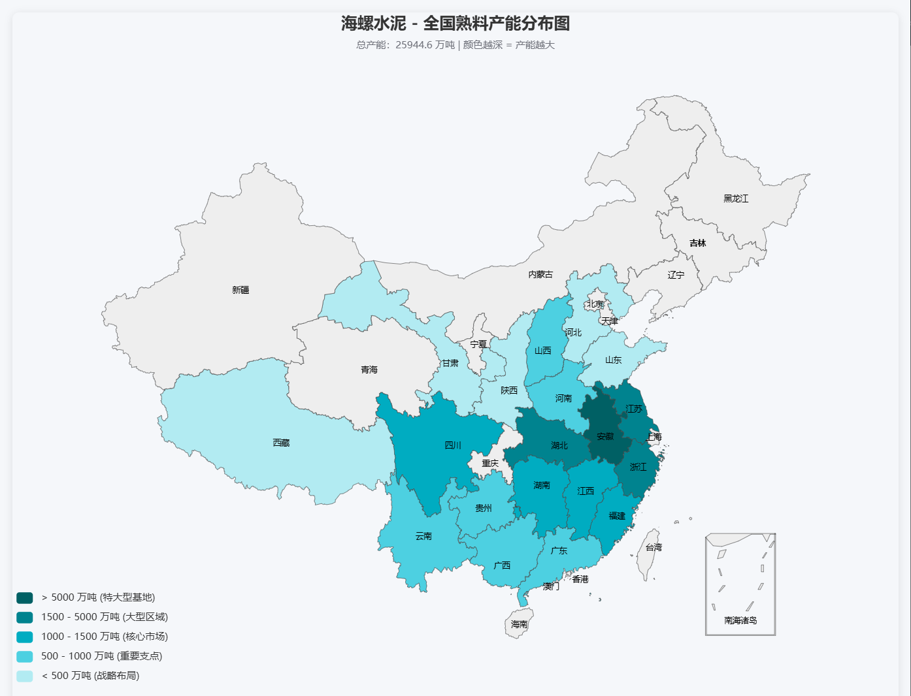

## 日本水泥复盘

**日本水泥泡沫危机时盈利水平 1990~2010**

按日本官方最接近“行业财务”的口径，我能给出的最好连续表是 METI 的“企业活动基本调查”中 `セメント・同製品製造業`（水泥及其制品制造业）这一类。先说明两点：这是一套“年度”数据，不是自然年；而且它覆盖的是`从业员50人以上且资本金3000万日元以上`的企业，不是所有极小企业。[调查概要](https://www.meti.go.jp/statistics/tyo/kikatu/gaiyo.html)；[年度结果总索引](https://www.meti.go.jp/statistics/tyo/kikatu/result-2.html)

1990~2002 单位都是`百万円`。我把“营收”按`売上高計`，“净利润”按`税引後当期利益`整理如下：
按上一条同一口径继续补充：日本经产省 `企業活動基本調査`，行业为 `セメント・同製品製造業`，`营收=売上高`，`净利润=税引後当期利益`。单位都是 `百万円`，而且这里是`年度`，不是自然年。

行业口径仍是经产省 `セメント・同製品製造業`，所以是“水泥及其制品制造业”，不是只含纯水泥厂。

价格我用日本银行可连续追溯的官方序列：`ポルトランドセメント`、`消費税除く`、`年度平均`、`2020年平均=100`。 

`营业费用`：更宽的企业经营成本口径

`卖上原价`：更窄的销货/生产成本口径

| 年度 | 营收 | 净利润 | 水泥价格指数 | 营业利润 | 卖上原价 | 利润率(%) |
|------|-----:|-------:|-------------:|---------:|---------:|----------:|
| 1990 | — | — | 96.46 | — | — | — |
| 1991 | — | — | 96.02 |  162,192 |  | — |
| 1992 | — | — | 92.87 | — | — | — |
| 1993 | — | — | 90.38 | — | — | — |
| 1994 | 2,198,428 | 17,159 | 84.92 | 56,552 |  | 0.78 |
| 1995 | 2,252,162 | 23,205 | 83.63 | 49,537 |  | 1.03 |
| 1996 | 2,143,026 | 32,011 | 84.62 | 76,733 |  | 1.49 |
| 1997 | 1,979,315 | 22,234 | 85.49 | 52,948 |  | 1.12 |
| 1998 | 1,828,986 | 1,662 | 82.28 | 33,940 |  | 0.09 |
| 1999 | 1,881,267 | -14,968 | 81.52 | 58,985 |  | -0.80   |
| 2000 | 1,855,512 | -7,569 | 80.66 | 69,631 |  | -0.41   |
| 2001 | 1,770,730 | 5,329 | 78.19 | 55,834 |  | 0.30 |
| 2002 | 1,625,153 | -6,577 | 76.18 | 50,031 |  | -0.40   |
| 2003 | 1,489,053 | 2,269 | 76.96 |  |  | 0.15 |
| 2004 | 1,664,369 | 21,581 | 77.86 |  |  | 1.30 |
| 2005 | 1,541,634 | -25,224 | 78.55 |  |  | -1.64   |
| 2006 | 1,518,355 | 19,231 | 79.42 |  |  | 1.27 |
| 2007 | 1,600,468 | 13,756 | 79.43 |  |  | 0.86 |
| 2008 | 1,627,106 | -62,005 | 87.52 |  |  | -3.81 |
| 2009 | 1,304,706 | -38,393 | 92.33 |  |  | -2.94 |
| 2010 | 1,181,334 | 18,556 | 92.70 |  |  | 1.57 |

日本水泥企业1990~2010营收及利润

补两句说明：
- 单位里，`价格`是指数，不是`日元/吨`；`成本`是`百万円`。
- `1990/1992/1993年度`成本缺口，不是我漏了，而是经产省这套调查早期不是按今天这种年度连续发布。
- `2004~2010`的`卖上原价`，我是按官方表里的`卖上高 - 卖上总利益`反推的；`1991`和`1994~2003`则是原表直接给出的`売上原価`。
- `2001年度`起，官方说明该调查的行业分类发生过一次改订，所以`2001-2002`与`1994-2000`并非绝对无缝可比。[年度结果总索引](https://www.meti.go.jp/statistics/tyo/kikatu/result-2.html)
- 1999年度 和 2000年度 的营业利润其实仍分别是 58,985 和 69,631百万円，说明当时不是主营业务先彻底崩掉，而是低利润状态下，再叠加营业外/财务/重组类项目，才把净利润压成负数。

主要来源：
[日本银行 flat-file 下载页](https://www.stat-search.boj.or.jp/ssi/docs/info/dload.html) · [CGPI 接续指数品目 CSV](https://www.stat-search.boj.or.jp/ssi/docs/info/cgpilink2.csv)  
[经产省 企业活动基本调查概要](https://www.meti.go.jp/statistics/tyo/kikatu/gaiyo.html) · [结果索引](https://www.meti.go.jp/statistics/tyo/kikatu/result-2.html)

整理版在这里：[cement_2010_2025_conch.md](/C:/Users/Administrator/Documents/Codex/2026-04-28/2010-2025/cement_2010_2025_conch.md)

## 海螺及行业盈利水平

**数据表**
口径先说明一句：海螺这列我优先用了年报里最连续可得的“水泥和熟料合计净销量”；利润用“归母净利润”。行业利润则尽量用国家统计局口径经水泥网/水泥大数据整理后的“利润总额”。

数量单位为亿吨，金额单位为亿元

| 年份 | 中国水泥产量 | 海螺水泥销量 | 中国水泥行业利润 | 海螺水泥利润 | 海螺利润占行业利润 |
| --- | ---: | ---: | ---: | ---: | ---: |
| 2010 | 18.68 | 1.37 | 611.0 | 61.71 | 10.1% |
| 2011 | 20.85 | 1.58 | 1020.0 | 115.90 | 11.4% |
| 2012 | 21.84 | 1.87 | 657.0 | 63.08 | 9.6% |
| 2013 | 24.14 | 2.28 | 765.5 | 93.80 | 12.3% |
| 2014 | 24.76 | 2.49 | 780.2 | 109.93 | 14.1% |
| 2015 | 23.48 | 2.56 | 329.7 | 75.16 | 22.8% |
| 2016 | 24.03 | 2.77 | 518.0 | 85.30 | 16.5% |
| 2017 | 23.16 | 2.95 | 877.0 | 158.55 | 18.1% |
| 2018 | 21.77 | 3.68 | 1546.0 | 298.14 | 19.3% |
| 2019 | 23.30 | 4.32 | 1867.0 | 335.93 | 18.0% |
| 2020 | 23.77 | 4.53 | 1832.5 | 351.30 | 19.2% |
| 2021 | 23.60 | 4.09 | 1694.0 | 332.67 | 19.6% |
| 2022 | 21.30 | 3.10 | 686.0 | 156.76 | 22.9% |
| 2023 | 20.23 | 2.93 | 310.3 | 104.28 | 33.6% |
| 2024 | 18.30 | 2.71 | 260.0 | 76.96 | 30% |
| 2025 | 16.90 | 2.65 | 290.0 | 81.13 | 27% |

海螺利润和行业利润

**说明**

- `2010` 行业利润 `611亿元` 是按工信部披露的 `2011年利润1020亿元、同比增长67%` 倒推的近似值。
- `2024` 行业利润我采用了中国水泥网后续更新口径 `约260亿元`，没有采用年初更早的低位预估。
- 中国水泥网: 
  - 预计2024年国内水泥行业整体利润总额在260亿元左右，在剔除骨料等非水泥业务及海外水泥利润后，行业利润预计在160亿元上下。
  - 预计2025年行业纯水泥业务利润总额或在180~200亿元上下，若考虑到海外、骨料、投资业务等非水泥业务利润，全部利润总额或在280-300亿元左右
- 2021–2023 这三年的行业利润，**应理解为“境内规上水泥行业利润口径”，不含中资企业海外利润；但也不是上市公司合并报表那种‘全球并表利润’口径。**

若纯粹采用国内业务估值，则海螺利润占比分别是：48% / 43%

2025年利润占比下滑，主要是海螺所在产区的水泥价格低于全国整体，华北、东北价格大于长江地区。如果按海螺所在地区的水泥行业来算，利润占比应该是提高的。

**主要来源**

- [国家统计局：2025年国民经济和社会发展统计公报](https://www.stats.gov.cn/sj/zxfbhjd/202602/t20260228_1962662.html)
- [国家统计局：2024年国民经济和社会发展统计公报](https://www.stats.gov.cn/zwfwck/sjfb/202502/t20250228_1958817.html)
- [国家统计局：2012年国民经济发展稳中有进（含2012全年主要产品产量）](https://www.stats.gov.cn/sj/zxfb/202302/t20230203_1898251.html)
- [中国水泥网：2011年我国水泥工业运行情况统计](https://www.ccement.com/news/content/50593.html)
- [中国水泥网：2023年中国水泥行业利润总额](https://m.ccement.com/news/content/44869092539685001.html)
- [中国水泥网：2025年水泥行业盈利预测（文内回溯2024利润口径）](https://m.ccement.com/news/content/52479408013195001.html)
- [海螺水泥2011年报摘要](https://static.cninfo.com.cn/finalpage/2012-03-27/60731209.PDF)
- [海螺水泥2024年报摘要](https://static.cninfo.com.cn/finalpage/2025-03-25/1222882791.PDF)
- [海螺水泥2025年报报道](https://finance.sina.com.cn/jjxw/2026-03-24/doc-inhsavws1701045.shtml?froms=ggmp)

如果你要，我下一步可以直接把这张表再导成 Excel，并补一列“逐年来源链接”。

## 日本房地产企稳

日本泡沫后，房地产“企稳”在数据上最典型的特征，不是一下子转牛，而是 `先止跌、再分化修复、最后才扩散到全国`。

**核心结论**
日本经验里，真正可称为企稳，通常会同时出现这几类信号：

- `价格跌幅连续收窄`，先从大跌变小跌，再到横盘，最后才小幅转正。
- `核心城市先稳`，东京、大阪、名古屋和地方核心城市先修复，全国平均很晚才跟上。
- `半年或季度边际数据先转正`，往往比全年平均更早。
- `租金和空置率先改善于商业地产`，说明不是纯政策托底，而是现金流在修复。
- `新开工/住宅着工不再创新低`，而是在低位连续回升 2 到 4 年。
- `银行坏账和资产负债表先修复`，金融修复常常早于全国房价企稳。
- `空置未必同步下降`，全国库存和空置可以继续偏高，但边际恶化要先停下来。

**日本数据怎么体现**
先看价格。国土交通省地价公示显示，`2008年` 全国住宅地还一度同比 `+1.3%`、商业地 `+3.8%`，但金融危机后又回落；到 `2010年` 全国住宅地变成 `-4.2%`、商业地 `-6.1%`，`2011-2014年` 仍持续为负，只是跌幅逐年收窄。到了 `2015年`，全国住宅地仍是 `-0.4%`，但商业地已经 `0.0%`，而且同一批可比点的半年数据里，全国住宅地前半段 `+0.3%`、后半段 `+0.2%`，商业地前后半段都是 `+0.5%`。这就是很典型的“全年还没转正，但边际已经稳了”。再往后到 `2018年`，全国住宅地才终于转为 `+0.3%`，是 `10年` 来首次上升；地方圈商业地则是 `26年` 来首次转正。

再看分化。`2015年` 的官方表述已经很清楚：三大都市圈住宅、商业地大多继续上涨或横盘，但地方圈仍有约七成地点在下跌。也就是说，日本的企稳不是“全国同时到底”，而是 `都市圈先修复、地方继续出清`。这点很重要。

再看供给。国土交通省住宅着工统计显示，`2002年度` 新设住宅着工 `1,145,553户`，还是连续下滑；但到 `2004年` 已回升到 `1,189,049户`，且着工面积是 `4年` 来首次增长；`2005年` 到 `1,236,175户`，`2006年` 到 `1,290,391户`，形成连续 `3到4年` 的低位修复。日本的供给修复也不是暴弹，而是“先不再恶化，再缓慢恢复”。

再看金融。金融厅数据表明，银行体系不良债权在 `2004年3月末` 为 `26.6万亿日元`，到 `2005年3月末` 降到 `17.9万亿`；全国银行不良债权比率从 `5.8%` 降到 `4.0%`，主要银行从 `5.2%` 降到 `2.9%`。到 `2006年3月末`，主要银行不良债权比率进一步降到 `1.8%`。这说明日本那一轮较像样的地产企稳，背后有非常明显的 `银行资产负债表修复`。

最后看空置。总务省统计局数据显示，空置房数量从 `1993年` 的 `448万户` 增到 `2013年` 的 `820万户`；空置率 `1998年` 已超过 `10%`，之后还在继续上升。也就是说，`价格企稳不等于库存问题立刻消失`，日本是典型的“核心区域先稳，全国空置压力仍长期存在”。

**如果把日本经验压缩成一套判断框架**
更像企稳的信号是：

- 全国价格同比连续 2 到 3 年收窄，而不是单月反弹。
- 核心城市先转正，外围城市跌幅同步缩窄。
- 半年/季度可比口径先转正，再传导到全年平均。
- 商业地产的空置率下降、租金回升，说明现金流修复。
- 新开工或住宅着工停止下滑，并出现 2 年以上低位回升。
- 银行不良、地产相关信用风险明显下降。
- 但全国空置率、存量库存不一定马上回落。

所以，日本式“企稳”的数据画像，不是 `V 型反转`，而是 `长时间缩量出清后，核心城市先稳、边际指标先正、金融先修复、全国后扩散`。

来源：
[国土交通省 地价变动率推移](https://www.mlit.go.jp/totikensangyo/totikensangyo_fr4_000140.html)
[国土交通省 2015年地价公示结果概要](https://www.mlit.go.jp/totikensangyo/totikensangyo_fr4_000070.html)
[国土交通省 2018年地价公示结果概要](https://www.mlit.go.jp/totikensangyo/H30kouji00.html)
[国土交通省 2015年都道府县地价调查概要](https://www.mlit.go.jp/totikensangyo/totikensangyo_fr4_000064.html)
[国土交通省 2018年都道府县地价调查概要](https://www.mlit.go.jp/totikensangyo/totikensangyo_fr4_000092.html)
[国土交通省 2004/2005/2006年住宅着工统计](https://www.mlit.go.jp/toukeijouhou/chojou/kencha04.htm)
[国土交通省 2005年度住宅着工统计](https://www.mlit.go.jp/toukeijouhou/chojou/kencha_h17.htm)
[金融厅 2005年3月末不良债权](https://www.fsa.go.jp/news/newse/e20050729-1.html)
[金融厅 2005年9月末不良债权](https://www.fsa.go.jp/news/newse/e20060120-1.html)
[统计局 空置房与空置率](https://www.stat.go.jp/data/jyutaku/2013/tokubetu.htm)

如果你愿意，我下一条可以直接把这个框架改成 `中国房地产是否企稳` 的对照表，一项一项拿中国现状去比。

## 国内房地产数据

截至 `2026年4月28日`，最新官方数据是 `2026年1-3月` 全国房地产开发销售数据和 `2026年3月` 70城房价。按“日本式企稳标准”去看，我的结论是：

`中国现在更像“核心城市先稳，全国仍在筑底”，还不能判定全国房地产已经企稳。`

1. `价格是否全国性止跌：不满足`
- `2026年3月`，一线城市新房价格环比 `+0.2%`、二手 `+0.4%`；但二线新房 `-0.2%`、二手 `-0.2%`，三线新房 `-0.3%`、二手 `-0.4%`。
- `70城` 里，3月新房环比上涨城市只有 `14个`，二手只有 `13个`。
- 同比仍普遍为负：一线新房 `-2.2%`，二线 `-3.3%`，三线 `-4.0%`；一线二手 `-7.4%`，二线 `-6.2%`，三线 `-6.4%`。
- 这说明目前只是 `环比局部回暖`，不是 `全国同比止跌`。

2. `核心城市是否先稳：基本满足`
- `2025年12月`，一线城市新房环比还是 `-0.3%`，二手 `-0.9%`。
- 到 `2026年3月`，北京、上海、广州、深圳二手环比分别 `+0.6% / +0.4% / +0.2% / +0.4%`；新房北京持平，上海、广州、深圳分别 `+0.3% / +0.3% / +0.2%`。
- 上海新房同比已经 `+3.7%`。
- 这符合日本式企稳里最先出现的特征：`核心城市先稳。`

3. `成交/需求是否连续改善：不满足`
- 全国新建商品房销售面积同比依次是：
`2025Q1 -3.0%`，`2025H1 -3.5%`，`2025年前三季度 -5.5%`，`2025全年 -8.7%`，`2026Q1 -10.4%`。
- 销售额同比依次是：
`2025Q1 -2.1%`，`2025H1 -5.5%`，`2025年前三季度 -7.9%`，`2025全年 -12.6%`，`2026Q1 -16.7%`。
- 也就是说，`2025年初一度接近修复，但后面重新转弱，2026Q1又走差。`
- 补充说明：全国没有统一官方“二手房成交量”高频口径。按中指重点城市口径，`2024年30城二手房成交约165.7万套，同比+7%`，`2025年1-11月159万套，同比+2%`，但 `2026年一季度重点20城同比又约-5.7%`。这也说明需求没有形成稳定上升通道。

4. `开工/投资是否不再探底：不满足`
- 房屋新开工面积：
`2024年 73893万平，同比-23.0%`
`2025年 58770万平，同比-20.4%`
`2026Q1 10373万平，同比-20.3%`
- 房地产开发投资：
`2024年 -10.6%`
`2025年 -17.2%`
`2026Q1 -11.2%`
- 国房景气指数：
`2025年3月 93.96`，`6月 93.60`，`9月 92.78`，`12月 91.45`，一直低于 `95` 的“适度景气线”。
- 这说明供给端和投资端 `还在深度收缩`，没有出现日本那种“低位连续回升2-4年”的信号。

5. `库存/待售是否停止恶化：部分满足`
- 商品房待售面积同比：
`2024年末 +10.6%`
`2025Q1 +5.1%`
`2025H1 +4.1%`
`2025年前三季度 +3.6%`
`2025年末 +1.6%`
`2026Q1 -0.1%`
- `2026Q1` 新增了一个更有用的口径：`待售3年以下面积 59012万平，同比-1.8%`。
- 这是当前全国最积极的信号，说明 `库存边际确实在改善`，但还谈不上彻底出清。

6. `金融是否先修复：风险稳住了，但需求没回来`
- 商业银行不良贷款率：
`2025Q1 1.51%`，`Q2 1.49%`，`Q3 1.52%`，基本稳定。
- 房地产开发贷款余额：
`2025Q1 13.87万亿元，同比+0.8%`
`2025Q2 13.81万亿元，同比+0.3%`
`2025Q3 13.61万亿元，同比-1.3%`
- 个人住房贷款余额：
`2025Q1 37.9万亿元，同比-0.8%，一季度增加2144亿元`
`2025Q2 37.74万亿元，同比-0.1%，上半年仅增加510亿元`
`2025Q3 37.44万亿元，同比-0.3%，前三季度减少2411亿元`
- 含义很直接：`金融系统没有失稳，但居民按揭需求并没有稳定恢复。`

如果把结论压成一句话：

`中国现在满足的是“核心城市先稳、库存边际改善、金融风险未失控”；不满足的是“全国价格止跌、成交连续回升、开工投资见底”。所以当前还不是全国性企稳，而是“核心城市先稳、全国分化筑底”。`

如果你要我再往前推一步，我会把真正能确认“企稳”的3个门槛定成：

- `全国销售面积同比` 连续 `2个季度` 回到 `0附近或转正`
- `新开工面积同比` 从 `-20%` 左右收窄到 `个位数负增长`
- `二三线城市房价同比` 也开始普遍收窄，而不是只有一线城市环比转正

**来源**
- [2026年1—3月份全国房地产市场基本情况](https://www.stats.gov.cn/sj/zxfbhjd/202604/t20260416_1963327.html)
- [2025年全国房地产市场基本情况](https://www.stats.gov.cn/xxgk/sjfb/zxfb2020/202601/t20260119_1962324.html)
- [2024年全国房地产市场基本情况](https://www.stats.gov.cn/xxgk/sjfb/zxfb2020/202501/t20250117_1958328.html)
- [国家统计局解读：2026年3月份商品住宅销售价格](https://www.stats.gov.cn/sj/zxfbhjd/202604/t20260416_1963319.html)
- [国家统计局解读：2025年12月份商品住宅销售价格](https://www.stats.gov.cn/sj/sjjd/202601/t20260119_1962317.html)
- [2025年上半年全国房地产市场基本情况](https://www.stats.gov.cn/sj/zxfbhjd/202507/t20250715_1960410.html)
- [2025年1—9月份全国房地产市场基本情况](https://www.stats.gov.cn/sj/zxfb/202510/t20251020_1961609.html)
- [2025年一季度金融机构贷款投向统计报告](https://www.pbc.gov.cn/goutongjiaoliu/113456/113469/2025092212554751302/index.html)
- [2025年二季度金融机构贷款投向统计报告](https://www.pbc.gov.cn/goutongjiaoliu/113456/113469/2025092212554883025/index.html)
- [2025年三季度金融机构贷款投向统计报告](https://www.pbc.gov.cn/goutongjiaoliu/113456/113469/5877760/index.html)
- [2025年一季度银行业保险业主要监管指标数据情况](https://www.gov.cn/lianbo/bumen/202505/content_7024119.htm)
- [2025年二季度银行业保险业主要监管指标数据情况](https://www.gov.cn/lianbo/bumen/202508/content_7036764.htm)
- [2025年三季度银行业保险业主要监管指标数据情况](https://www.gov.cn/lianbo/bumen/202511/content_7048625.htm)
- 二手房成交补充口径：中指研究院 [2024总结](https://m.cih-index.com/news/2025-01-02/51902939.html)、[2025总结](https://m.cih-index.com/news/2025-12-11/53937401.html)、[2026Q1](https://m.cih-index.com/news/2026-03-31/54496656.html)

如果你愿意，我下一条可以把这些数据整理成一张 `“中国版企稳判断表”`，直接给你做成适合汇报的表格。

## 行业对比

基于最新已披露的 **2025 年报** 来看，先给结论：

**如果你要看“水泥主业的真实资产负债表压力”，真正该对比的是天山股份和金隅冀东；中国建材不能和天山简单并列，因为天山已经在中国建材表内。**  
天山 2025 年末前十大股东里，中国建材股份持股 **81.14%**，所以中国建材的水泥风险，核心就是通过天山传导出来的。

| 公司     | 2025年末总资产 | 归母/普通股权益 | 表观负债率 | 现金 vs 1年内有息压力 | 穿透后判断                                                   |
| -------- | -------------: | --------------: | ---------: | --------------------: | ------------------------------------------------------------ |
| 中国建材 |     4,895 亿元 |        947 亿元 |      61.9% |      238 亿 vs 906 亿 | 表面不差，但少数股东权益和永续资本很大，普通股东口径杠杆并不轻 |
| 天山股份 |     2,760 亿元 |        753 亿元 |     66.83% |       89 亿 vs 494 亿 | 三家里压力最大，典型“重资产+高负债+长账龄应收+大商誉”        |
| 金隅冀东 |       573 亿元 |        276 亿元 |     48.39% |        60 亿 vs 94 亿 | 三家里最干净，仍重资产，但债务和商誉包袱明显轻于天山         |

**一层层穿透：**

中国建材看起来是集团报表，**其实不是纯水泥报表**。  
它 2025 年末总权益 **1,864 亿元**，但其中 **少数股东权益 757 亿元、永续资本工具 160 亿元**，真正归普通股东的只有 **947 亿元**。也就是说，接近一半权益并不属于普通股东。与此同时，集团借款 **1,930 亿元**，一年内到期借款 **906 亿元**，账上现金只有 **238 亿元**；再加上 **商誉 318 亿元、无形资产 332 亿元**，2025 年又明显增加了坏账损失和水泥产线相关减值。所以中国建材的问题不是“有没有资产”，而是**归母权益含金量没有表面那么厚**。

天山股份是中国建材水泥资产负债表压力最集中的地方。  
2025 年末它的 **固定资产 1,105 亿元、在建工程 205 亿元、长期股权投资 114 亿元**，再叠加 **商誉账面价值 243 亿元**。应收账款净额 **265 亿元**，但应收账款原值 **325 亿元**、坏账准备 **60 亿元**，其中 **3年以上 80 亿元、5年以上 48 亿元**，这说明资产质量压力很实。负债端更关键：**短借 222 亿元、1年内到期非流动负债 271 亿元、长期借款 569 亿元、应付债券 70 亿元**；而 `其他应付款` 里还有 **192 亿元“资金拆借款”**，这类科目本质上接近融资性负债。它的 **流动比率只有 0.4776，速动比率只有 0.3950**，这是三家里最紧的。

金隅冀东也很重资产，但报表明显更干净。  
2025 年末 **固定资产 297 亿元、无形资产 76 亿元、商誉只有 5.7 亿元**，远低于天山。应收账款净额 **22.7 亿元**，原值 **30.2 亿元**，坏账准备 **7.52 亿元**，计提比例 **24.89%**，比天山更保守；虽然 **5年以上应收仍有 5.78 亿元**，但体量可控。债务端是 **短借 27 亿元、1年内到期非流动负债 67 亿元、长期借款 68 亿元、债券 30 亿元**，资产负债率 **48.39%**，明显低于天山。它也有流动缺口，但规模只有 **约 25 亿元**，远没有天山那么压迫。

**一句话总结：**

- 看集团层资本结构：**中国建材的“表观稳健”被少数股东权益和永续资本稀释了。**
- 看水泥平台真实压力：**天山股份是三者里最重、最脆的一张表。**
- 看北方水泥可比公司：**金隅冀东虽然也是重资产行业，但报表质量和债务结构明显优于天山。**

如果你愿意，我下一步可以继续给你做一版 **“穿透后可比口径表”**，把三家统一拆成：
`经营性资产 / 可疑资产 / 刚性债务 / 隐性债务 / 归母真实净资产`，这样更适合直接用于投资判断。

来源：
- [中国建材 2025 年业绩公告/HKEX](https://www.hkexnews.hk/listedco/listconews/sehk/2026/0331/2026033100719.pdf)
- [天山股份 2025 年年度报告](https://vip.stock.finance.sina.com.cn/corp/view/vCB_AllBulletinDetail.php?CompanyCode=10001147&gather=1&id=12048625)
- [天山股份 2025 年年度审计报告](https://vip.stock.finance.sina.com.cn/corp/view/vCB_AllBulletinDetail.php?CompanyCode=10001147&gather=1&id=12048624)
- [金隅冀东 2025 年年度报告全文](https://stockmc.xueqiu.com/202603/601992_20260328_B6MN.pdf)
- [金隅冀东 2025 年年度审计报告](https://money.finance.sina.com.cn/corp/view/vCB_AllBulletinDetail.php?id=12025329&stockid=000401)

# 各企业对比
按2026年4月30日收盘市值（最新） + 2025年水泥+熟料销量口径：

1. 华新建材（600801）

• 最新市值：447.19亿元

• 2025年销量：6196万吨 = 0.6196亿吨

• 单吨产量市值：

447.19 ÷ 0.6196 ≈ \textbf{722元/吨}

2. 海螺水泥（600585）

• 最新市值：1119.74亿元

• 2025年销量：2.65亿吨

• 单吨产量市值：

1119.74 ÷ 2.65 ≈ \textbf{423元/吨}

3. 西部水泥（02233.HK）

• 最新市值：138.20亿港元≈124.4亿元（汇率0.9）

• 2025年销量：2180万吨 = 0.218亿吨

• 单吨产量市值：

124.4 ÷ 0.218 ≈ \textbf{571元/吨}

汇总（2025年单吨产量对应最新市值）

• 华新建材：722元/吨

• 西部水泥：571元/吨

• 海螺水泥：423元/吨

## 预计未来两年单吨市值比

先把前提统一一下：

• 市值：2026-04-30 收盘市值（人民币）

◦ 华新建材：447.19 亿

◦ 海螺水泥：1119.74 亿

◦ 西部水泥：124.4 亿（138.2 亿港元，汇率 0.9）

• 销量口径：水泥+熟料总销量

• 海螺：一直用 2025 年实际销量 2.65 亿吨，不变

• 华新、西部：2027/2028 年销量要把非洲产能爬坡算进去（基于现有产能规划和券商/市场一致预期做中性假设）
一、华新建材（600801）

已知基数

• 2025 年总销量：6196 万吨（国内 4165 万 + 海外 2030 万）

• 2026 年目标：6700 万吨（海外 2700 万）

• 非洲产能：2025 年底运营+在建 4000 万吨；2027 年预计基本达产、利用率抬升

中性假设（考虑非洲爬坡）

• 2027 年销量：8200 万吨（国内略降，非洲持续放量）

• 2028 年销量：9200 万吨（非洲产能利用率进一步提高）

单吨市值（最新市值 / 预测销量）

• 2027 年：447.19 ÷ 0.82 ≈ 545 元/吨

• 2028 年：447.19 ÷ 0.92 ≈ 486 元/吨
二、西部水泥（02233.HK）

已知基数

• 2025 年总销量：2180 万吨（国内约 1200 万 + 海外约 950 万）

• 海外产能：

◦ 2025 年底：1350 万吨

◦ 2026：2050 万；2027：2580 万；2028：3000 万+

• 非洲需求强、“产量≈销量”，产能投放后 1–2 年利用率爬至 85%–90% 是行业共识

中性假设（非洲爬坡）

• 2027 年总销量：3000 万吨（国内稳 1200 万，海外从 950 万→1800 万）

• 2028 年总销量：3600 万吨（海外进一步爬坡）

单吨市值

• 2027 年：124.4 ÷ 0.30 ≈ 415 元/吨

• 2028 年：124.4 ÷ 0.36 ≈ 346 元/吨
三、海螺水泥（600585）——固定用 2025 年销量

• 销量：2.65 亿吨（不变）

• 单吨市值：1119.74 ÷ 2.65 ≈ 423 元/吨
四、汇总表（元/吨，最新市值 / 当年预测销量）
公司 2025 年（实际） 2027 年（预测，含非洲爬坡） 2028 年（预测，含非洲爬坡） 
华新建材 722 545 486 
西部水泥 571 415 346 
海螺水泥 423 423（同 2025） 423（同 2025） 

