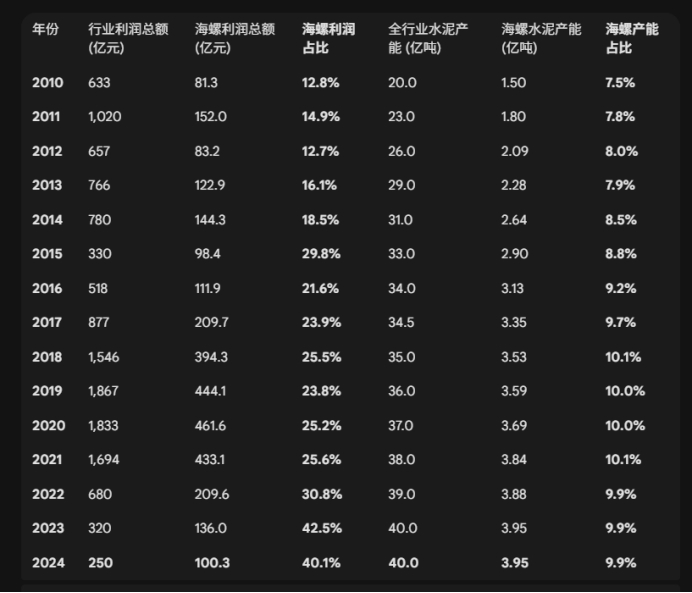
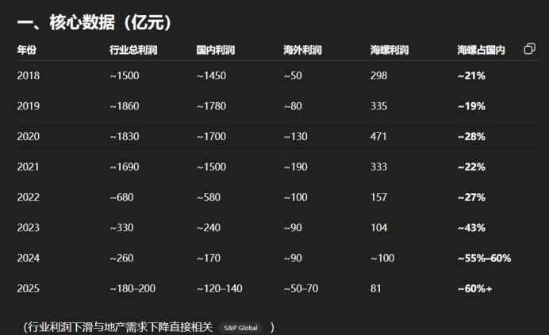
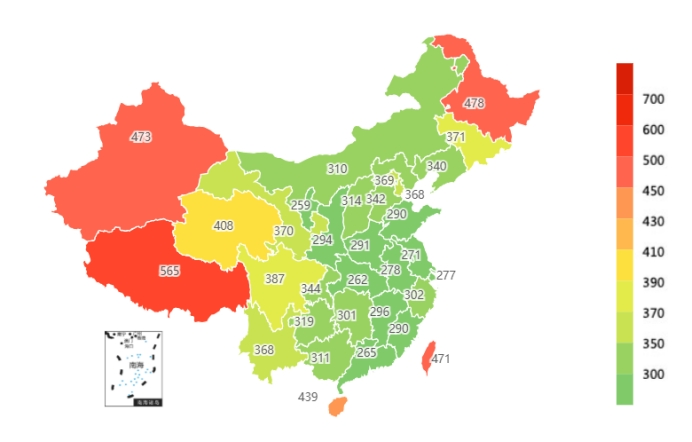
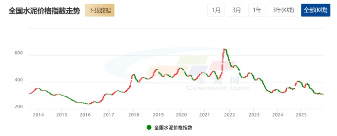

海螺水泥

prompt:给我2010～2025，中国水泥产量，海螺水泥产量，中国水泥行业利润，中国水泥行业国内利润，中国水泥行业国外利润，海螺水泥利润，海螺水泥利润占行业利润比例，海螺水泥占水泥行业国内利润的比例，上市Top10的水泥企业产量，上市Top10的水泥企业利润，上市Top10的水泥企业国内利润，上市Top10水泥企业国外利润，海螺水泥占上市Top10水泥企业国内利润的比例。以上数据尽可能从国家统计局和水泥网获取，如果没有数据的可以列为空，如果是其他地方的数据，在数据边加*表示

 

 

=>国泰君安-国际水泥系列

=>关于日本1990年以后水泥萧条的论文（中外投行）

水泥价格：

 

Reference:

Gemini: https://gemini.google.com/app/5e028df19a307cb1

FeishuDoc: https://yiyp8b81unm.feishu.cn/docx/NZdmd30rxoiQBBxongncN1zanfM

FeishuMap: https://yiyp8b81unm.feishu.cn/mindnotes/AXhkbiPOvm4Y69nDAWxcVq9Enue

江浙沪基建项目研究：

https://www.doubao.com/chat/36278418685712386

https://gemini.google.com/app/a577c7834df1e9cf

 

 

供给端从早期的去产量（错峰生产），到现在的去产能（产能置换标准+环保标准）。

日本的水泥

 

行文逻辑：

需求是否继续见底

房地产、基建

数据：

固定资产投资，

基础设施（不含电力、热力、燃气及水生产和供应业）投资

地方政府主导的公路投资

房屋施工面积、新开工面积、及竣工面积

 

2025年，全国六大区域水泥需求均较上年同期有较大下滑，其中东北、中南、华东和西北地区的下滑幅度超过全国，分别为9.15%、7.91%、7.55%和7.35%，华北地区下滑幅度为6.84%，西南地区因西藏等地基建项目开工，下滑幅度最小，但也达到了5.34%的降幅。

 

 

房地产

中日对比：

租金回报率（是否见底）

房价工资比，看幅度

消费观念的转变，不买房了

供给是否减少

中日对比

水泥产能是否减少

中日人均水泥消耗，是否消耗量见底

 

不知道什么时候反转，才能反转。知道什么时候反转，形成一致性预期，就无法反转。

 

价格信号

 

 

 

1. 海螺水泥以及水泥行业的性质分析

(1) 保质期短=>库存少=>存货风险无

(2) 物流敏感 + 低原材料价值 +保质期短 => 运输费用贵 => 区域有限竞争

(3) 能源敏感，能源占总成本的50%，原材料占25%

(4) 基建住房需求永远存在 => 永续（不用担心像白酒那样年轻人不喝）

(5) 周期

(6) 大宗资源品，不用担心技术替代

(7) 成本低

(8) 资产负债表优秀，600多亿现金，几乎无有息负债

2. 需求/供给/

(1) 需求

① 整体情况分析

1) 从下滑到基建50%、房地产30%、民用20%；房地产对水泥的拉动力正在快速失效。目前房地产每下降10%，对水泥总盘子的拖累只有2.5%-3%，影响权重在降低
2) 由于不同区域基建投资的差异，导致不同区域对水泥需求不同，进而影响价格，呈现出西部价格高，中部沿海价格低的区域特征
3) 西部地区得益于大型能源基地和交通干线建设，需求相对坚挺；而东部沿海地区随着城镇化率接近天花板，需求更多转向城市更新和修缮，这需要更精细化的产品而非大规模的熟料供应
4) 不同基建（水利、交通、港口）对水泥需求不同

② 江浙沪基建情况分析

1) 不同基建类型水泥用量
2) 基建的结构性变化，从土木工程转向数据中心和特高压等新技术
3) 地方政府债务压力制约基建速度/规模？

③ 房地产情况分析

1) 房地产到底了吗？

a. 量：二手房成交量连续 3-6 个月环比不再萎缩

b. 房企贷款利率

c. 是否重新开始拿地

d. 新房开工面积 / 整体房地产市场交易面积

e. 租金回报率

(2) 供给

① 全国整体产能产量情况

② 江浙沪整体产能产量情况

③ 江浙沪整体产能利用率

④ 因为价格的缘故，江浙沪只会比全国更差（去化更多）

⑤ 江浙沪亏损幅度

3. 价格/利润
4. 政策

(1) 错峰生产常态化

(2) 限制新产能与老产能置换

(3) 碳交易

5. 以日为鉴

(1) 人均水泥用量，国内多高楼，日本多木屋；国内多高速高铁等

(2) 供给出清情况，日本的护卫舰制度导致无法出清产能

 

 

 

 

 

 

所谓投资，就是对于未来所有时间和空间下的风险的管理。海螺水泥是我见过的A股标的里，风险点暴露最少的，甚至可以说是没有。

 

如果让我在A股里选一家我最喜欢的公司，不会是茅台，也不会是片仔癀，而是海螺水泥。

但如果让我在A股里选择一家长期持有的公司，我不会选任何公司。

或许有人说，房地产下滑是一个风险点，但当水泥价格低于成本时，就不是看需求，而是看供给了。当然需求下滑剧烈除外。而一旦看成本，这就是海螺的优势所在。

 

 

海螺水泥完美的长在了投资的审美点上：垄断+永续+周期+资产负债表干净+超高的容错+简单的模式+高精力投出产出比

 

水泥行业本身也是个很完美的商业模式，存货低，运费和保质期导致的区域有限竞争

 

考虑到当前宏观越来越复杂，水泥的超强稳定性很好

有限的一次投入，持续的回报

不用担心像茅台之流的消费品一样，喝的人越来越少

不用担心像海外的矿产一样被国家没收

不用担心像药明生物一样可能存在的竞争对手和技术替代

不用担心像公共事业股一样毫无波动

 

 

投资就是在做风险管理，我本身是个极度厌恶风险点的人，但有的时候你不得不在一些长尾风险很大的标的上仓位，比如中矿，2024 年的中矿是个极度完美的标的，但非洲矿的国有化可能性依然是个很小很小的风险点，这点让我极度难受。

 

对于市场的宽容度，如果是其他的，比如药明生物和中矿资源，熊市持股体验会非常难受

但海螺水泥有 4% 的分红，其实还是很可观的，熊市的持股体验会好很多很多

 

小概率房地产继续暴跌（10%）对应海螺下跌40%，大概率房地产企稳（60%）对应海螺涨50%~80%，中概率房地产反弹（30%）对应海螺涨100%~200%，极小概率房地产反转

 

 

 

全国各省水泥价格

 

 

 

 