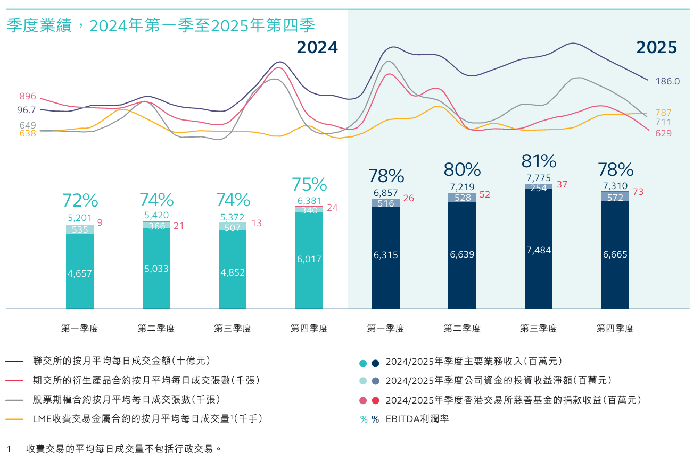
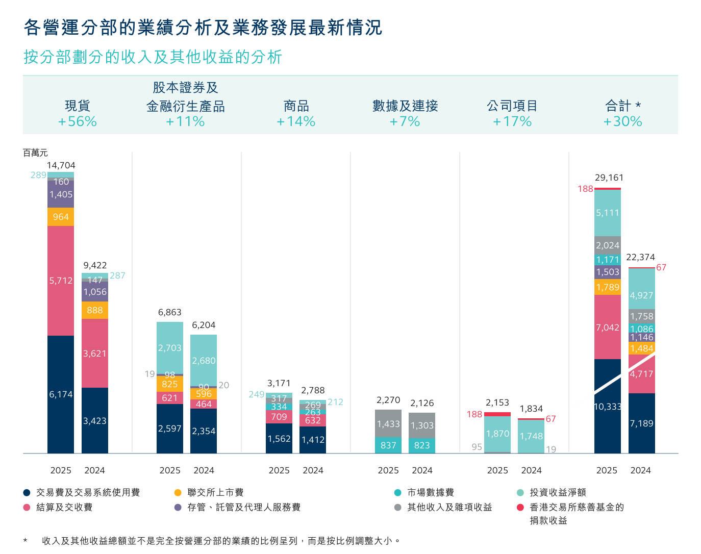
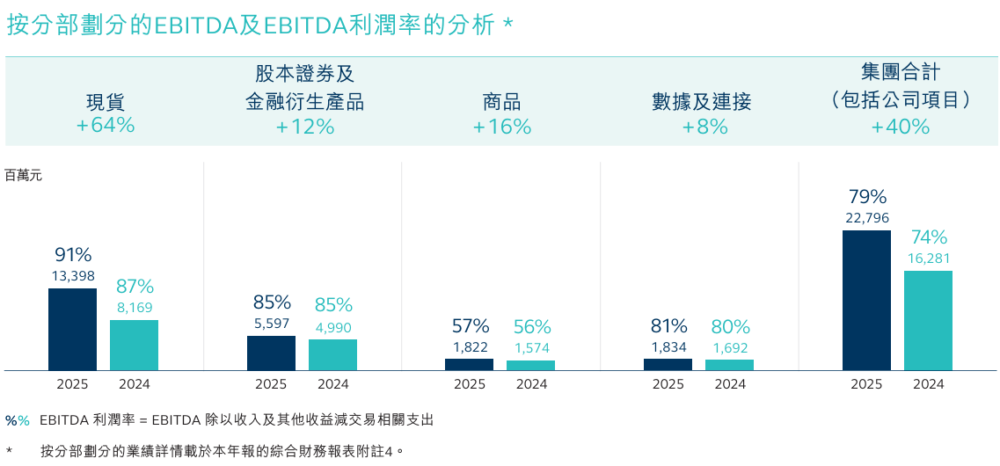

**现货多，没什么衍生品交易，这是为什么呢？是因为港股通没办法做衍生品吗？**

2025 年联交所股本证券产品的交易费收入为 54.35 亿元，较 2024 年上升 87%，主要源于股本证券产品平均每日成交金额上升。

交易费包括港股通费用收入 7.62 亿元，较 2024 年上升 **156%**

沪股通及深股通交易费收入上升 2.27 亿元（44%），升幅与离岸投资者对 A 股市场投资增加带动的沪股通及深股通成交量增幅一致。

| 项目 | 2025 | 2024 | 变幅 |
| :--- | :---: | :---: | :---: |
| 沪股通及深股通的成交金额（人民币十亿元） | 50,333 | 34,969 | 44% |
| 港股通的成交金额（十亿元） | 28,695 | 11,229 | 156% |
| 收入及其他收益总额¹（百万元） | 4,317 | 2,744 | 57% |

| 市场成交主要统计数据 | 2025 | 2024 | 2023 | 2022 | 2021 | 2020 | 2019 | 2018 | 2017 | 2016 |
| :--- | :---: | :---: | :---: | :---: | :---: | :---: | :---: | :---: | :---: | :---: |
| 联交所的整体平均每日成交金额（十亿元） | 249.8 | 131.8 | 105.0 | 124.9 | 166.7 | 129.5 | 87.2 | 107.4 | 88.2 | 66.9 |
| 期交所的衍生产品合约平均每日成交张数（千张） | 783 | 830 | 742 | 715 | 538 | 612 | 630 | 687 | 443 | 465 |
| 联交所的股票期权合约平均每日成交张数（千张） | 880 | 720 | 612 | 588 | 637 | 526 | 442 | 517 | 428 | 298 |
| LME的收费交易金属合约平均每日成交量（千手） | 717 | 664 | 562 | 506 | 547 | 571 | 617 | 627 | 602 | 618 |

